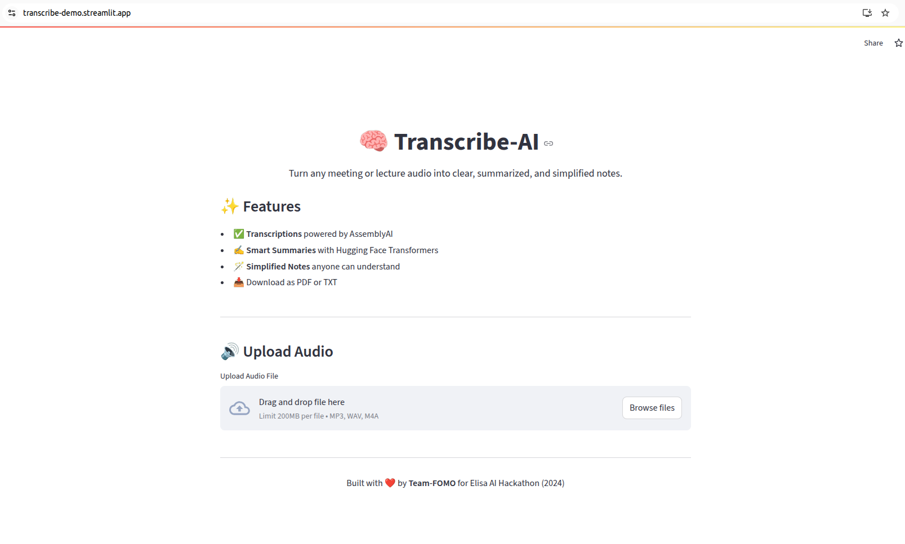

## Transcribe-AI

**Transcribe-AI** is a SaaS-style GenAI tool that transcribes, summarizes, and simplifies meeting or lecture audio using AssemblyAI and Hugging Face. It supports audio file uploads, end-to-end AI pipelines, PDF and TXT export, and is deployed live with Streamlit Cloud.

[Live Demo](https://transcribe-demo.streamlit.app/)  
[Watch Original Concept Demo](data/ELISA-AI-DEMO.mp4)

---

### The Problem

In today’s remote and flexible work environments, meetings and lectures are often recorded, but rarely revisited. People miss important sessions due to scheduling conflicts, time zone differences, or last-minute obligations. While recordings are available, few have the time or focus to sit through an hour of audio or video just to extract a few key points.

This creates a gap in how teams and students stay informed:
- Valuable information is buried in long, unstructured content
- Missed sessions result in knowledge gaps, reduced productivity, and confusion
- People often rely on others for a quick summary, which is inconsistent and unreliable

During the Elisa AI Hackathon, we spoke with professionals across industries (Visma, Nokia, KPMG) who confirmed this challenge:

> “I miss one meeting and waste half a day trying to catch up. I wish I could just get the summary.”

This is not just a minor inconvenience. It affects how quickly people can make decisions, stay aligned, and move work forward. 
We designed Transcribe-AI to address this challenge by turning long, unstructured recordings into clear, structured, and simplified insights.

---

### Our Solution

Transcribe-AI uses GenAI to break down audio content into essential information you can use immediately. Upload any audio file and receive:
- A full transcription
- A concise summary
- Simplified notes for fast understanding
- Optional downloads as PDF or TXT

Built originally for the **Elisa AI Hackathon 2024**, now production-ready and publicly hosted.

---

### How It Works

1. **Audio Upload** via Streamlit
2. **Speech-to-Text** using AssemblyAI
3. **Summarization & Simplification** using Hugging Face Transformers (`facebook/bart-large-cnn`)
4. **PDF/Text Export** via Python backend

---

### Screenshots & Demo

  
